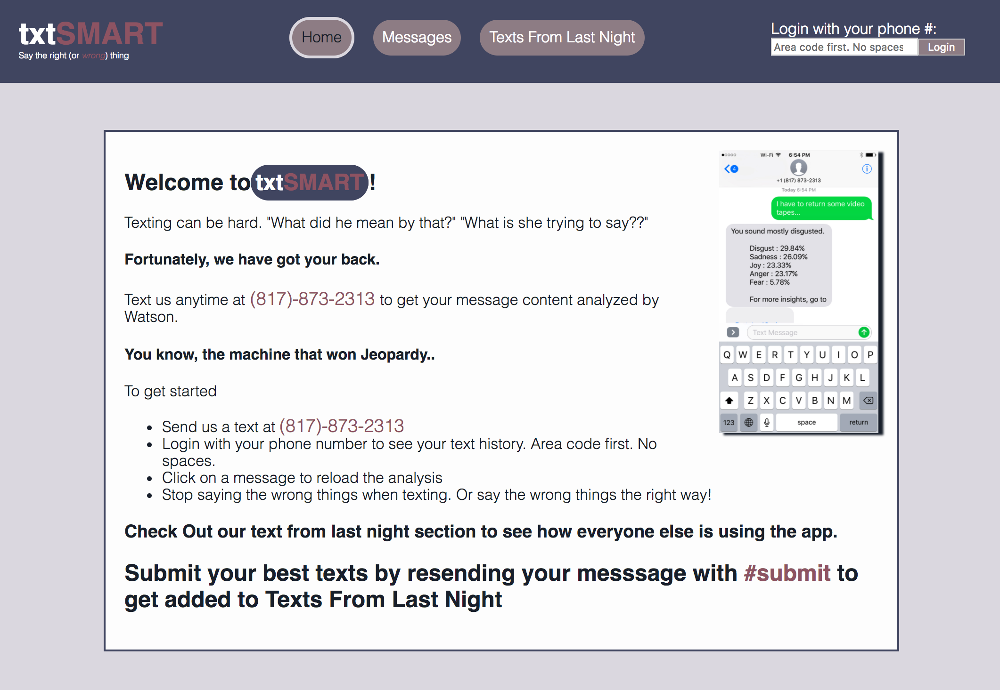

# txtSmart

I am currently in the process of rebuilding this application.
The rebuild can be seen at:

[UI](https://github.com/jsullivan5/txtsmrt-ui)
[API](https://github.com/jsullivan5/txtsmrt-api)

## Prerequisites

```
npm
```

```
git
```
```
Twilio and IBM Watson credentials
```
For Development:
```
ngrok
```

## Installation

  1. Clone this repo. `git clone git@github.com:jsullivan5/txtSMART.git`
  2. run `npm install`
  3. Sign up for a free Twilio SMS number.
    [TwilioSignup](https://www.twilio.com)
  4. Sign up for IBM Bluemix for free and request to use the Watson API
    [Develop With Watson](https://www.ibm.com/watson/developer/)
  5. configure .env file with credentials as seen in .sample.env

  6. To create http tunnel to use Twilio endpoint:
  ```
  ngrok http 3000
  ```
  Make sure to use generated `https` endpoint in Twilio console under SMS configuration
  7. Run `npm start`

## Objective

This app attempts to remove some of the ambiguity from reading and writing text messages.  A number was set up via Twilio that receives text messages from a user, sends off that data to Watson, and within seconds, the user receives a message from my application with sentiment analysis for the submitted content.

Furthermore, I created a community page where users can preface their text with '#submit' to be featured in the community page.  This was meant to gauge how people are using the app and to provide a social aspect.  Test users seemed to enjoy sending absurd and funny things to the app, and the community page provides an outlet for people to do that.

## Future Iterations

I would like to build out a database for this app to securely store user data and messages.  Given the time constraints on this project, I was unable to find the time.  That being said, future iterations will store user data and texts as they come in.  This will release me from relying on pulling the number's history on load.  

I would also like to build out a more robust community page.  This may feature categories and community upvoting.  I would also like to push this site to production.  and leave the number up for people to use.  This would only be viable with a database.  

I would also like to add sentiment and personality analytics for entire threads.  This is possible with the Watson API, just not with time constraints presently.

## Challenges

This was my first project that I had to build a back end with.  Learning how to coordinate calls between the client side and API took some getting used to.  

Furthermore, parsing how to use these API's was a challenge in and of itself.  Each had a unique helper library and vast documentation to go through.  

All and all, it was a lot of fun to build and I hope you enjoy it.

## ScreenShots


